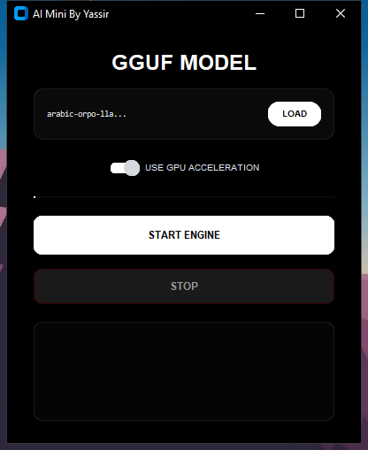
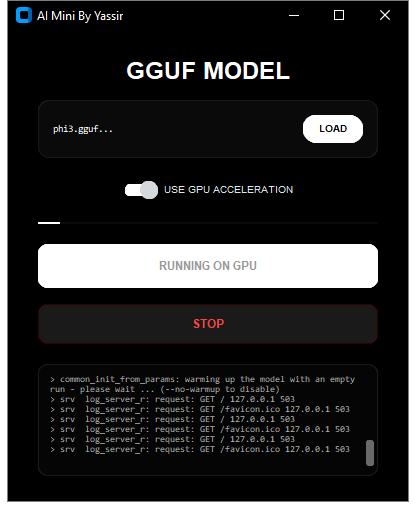
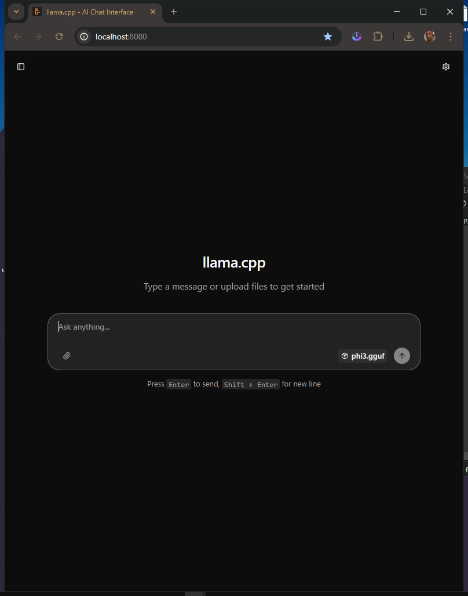
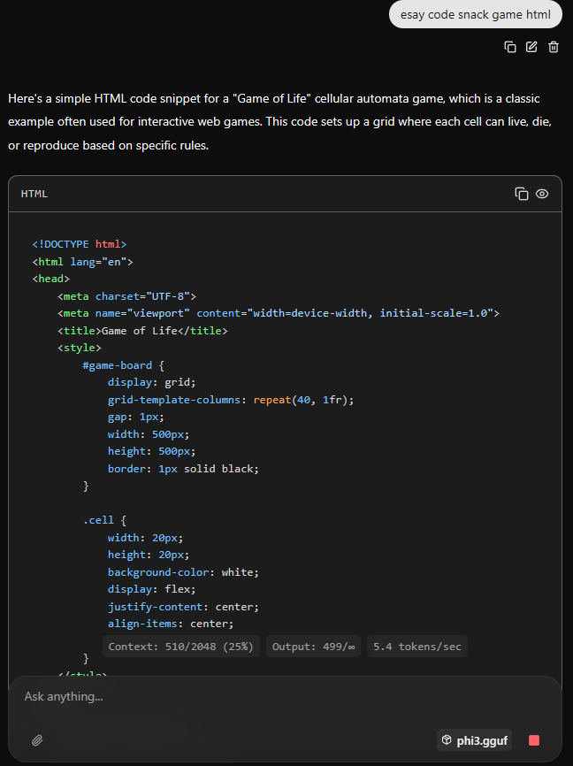

# easy-run-gguf-model
## GGUF model run with LLamacpp Download Here llama.cpp[here](https://github.com/ggml-org/llama.cpp)
#screen app from my desktop
# 1 app like

# 2 start model

# 3 open server (host)

# 4 model run (work)

### i use llama cpp for build this app enjoy
